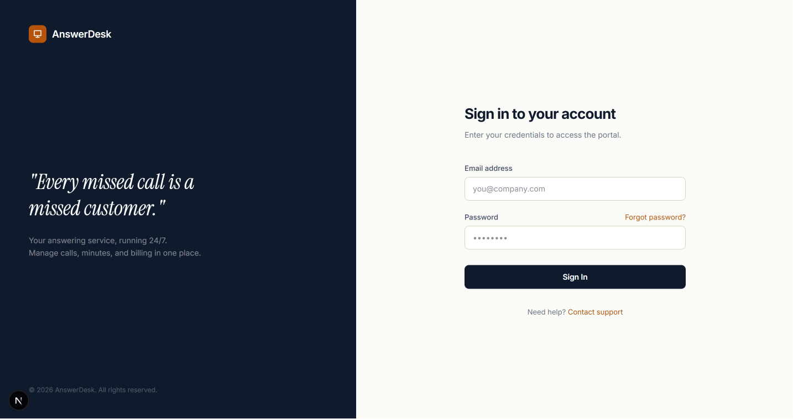
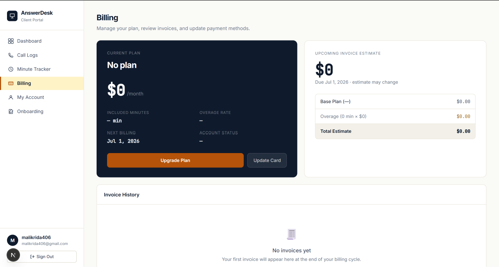
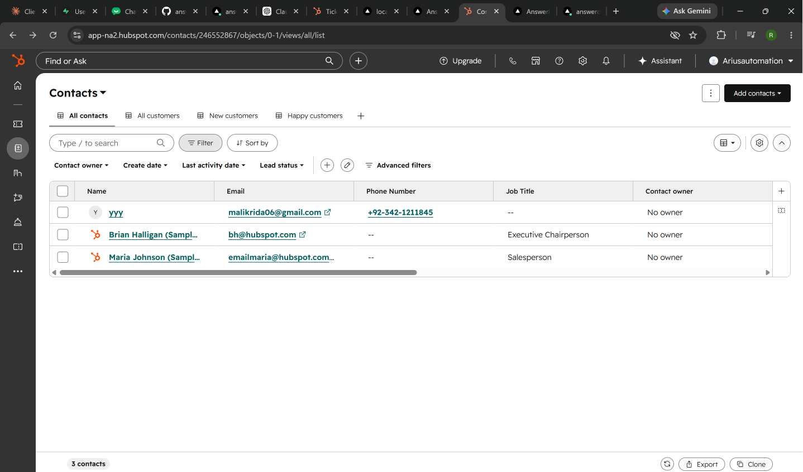

# AnswerDesk — Client Portal

A full-stack client portal for an answering service business. Clients can log in, view call logs, track minute usage, manage billing, and complete onboarding. Admins can manage all clients, view billing overview, and sync contacts to HubSpot CRM.

**Live:** [answerdesk-portal.vercel.app](https://answerdesk-portal.vercel.app)

---

## Tech Stack

- **Frontend:** Next.js 16 (App Router), Tailwind CSS
- **Backend/Auth:** Supabase (PostgreSQL + Auth)
- **CRM:** HubSpot (auto-sync on client creation)
- **Deployment:** Vercel

---

## Features

### Client Portal
- Secure email/password login via Supabase Auth
- **Dashboard** — minutes used ring chart, calls this month, next invoice, overage risk, recent calls, weekly usage bars
- **Call Logs** — full call history with filters, search, CSV export, pagination
- **Minute Tracker** — plan vs used vs remaining, daily/weekly breakdown, overage history
- **Billing** — current plan, upcoming invoice estimate, invoice history
- **My Account** — business info form, notification toggles, password change
- **Onboarding** — progress tracker, step checklist, call handling instructions

### Admin Panel
- Role-based access (admin email check)
- **All Clients** — searchable client table, MRR stats, Add Client modal
- **Client Detail** — contact info, plan & billing, usage stats, admin notes
- **Billing Overview** — MRR, overage revenue, plan distribution, issues
- **HubSpot Sync** — new client → contact auto-created in HubSpot CRM

---

## Screenshots

### Login


### Dashboard


### Call Logs


### Minute Tracker


### Billing


### My Account


### Onboarding


### Admin — All Clients


### Admin — Client Detail


### Admin — Billing Overview


### HubSpot CRM Sync


---

## Database Schema

| Table | Purpose |
|---|---|
| `clients` | Business info, plan, billing details |
| `calls` | Call logs per client |
| `invoices` | Invoice history |
| `onboarding_steps` | Checklist progress per client |
| `client_settings` | Greeting script, hours, message delivery |

RLS enabled — clients can only access their own data.

---

## Environment Variables

```env
NEXT_PUBLIC_SUPABASE_URL=
NEXT_PUBLIC_SUPABASE_ANON_KEY=
SUPABASE_SERVICE_ROLE_KEY=
HUBSPOT_ACCESS_TOKEN=
```

---

## Getting Started

```bash
git clone https://github.com/ridamalik26/answerdesk-portal
cd answerdesk-portal
npm install
# Add .env.local with your keys
npm run dev
```

---

## Built by

Rida Malik — [github.com/ridamalik26](https://github.com/ridamalik26) · [linkedin.com/in/rida-malik-softwareengineer](https://linkedin.com/in/rida-malik-softwareengineer)
